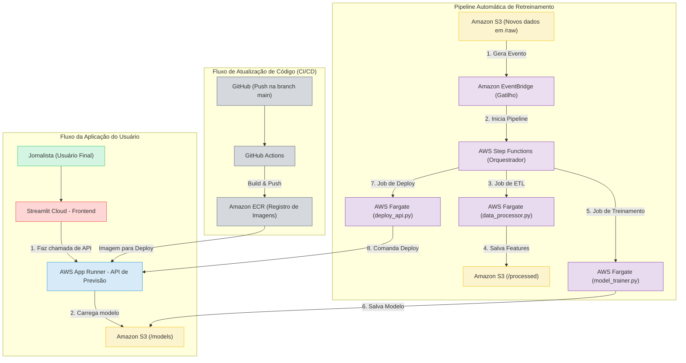

# Predictor Fut BR: Análise Preditiva do Brasileirão


## 📖 Descrição do Projeto

Este é um projeto completo de Machine Learning Operations (MLOps) que constrói, implanta e mantém um sistema para prever os resultados de partidas de futebol do Campeonato Brasileiro. A solução vai desde a engenharia de features a partir de dados brutos até a entrega de uma aplicação web interativa para o usuário final, com uma pipeline de retreinamento totalmente automatizada e orientada a eventos na AWS.

O objetivo principal foi construir um produto de dados de ponta a ponta, demonstrando habilidades em Engenharia de Dados, Arquitetura de Nuvem Serverless, Automação de CI/CD e MLOps.

## 🏛️ Arquitetura da Solução (v2.0)

O sistema é projetado em uma arquitetura de microsserviços e orientada a eventos, utilizando majoritariamente serviços "serverless" da AWS para otimizar custos e escalabilidade.



**Fluxo de MLOps (Retreinamento Automático):**
1.  **Gatilho:** Um novo arquivo `.csv` com dados de uma nova rodada é enviado para a pasta `raw/` no **Amazon S3**.
2.  **Detecção:** O **Amazon EventBridge** detecta o novo objeto e dispara uma regra.
3.  **Orquestração:** A regra inicia uma pipeline no **AWS Step Functions**.
4.  **Execução:** A pipeline executa uma sequência de tarefas no **AWS Fargate**:
    * **Passo 1:** Um contêiner processa os dados novos e antigos e salva uma nova tabela de features no S3.
    * **Passo 2:** Outro contêiner carrega as features, retreina o modelo de ML e salva o novo artefato do modelo no S3.
    * **Passo 3:** Um último contêiner comanda a API no **AWS App Runner** para iniciar um novo deploy.
5.  **Atualização:** A API no App Runner reinicia, baixa o modelo mais recente do S3 e passa a servir as novas previsões.
6.  
## 📊 Fonte dos Dados

Os dados utilizados neste projeto foram obtidos através do Kaggle, no dataset **"Campeonato Brasileiro de Futebol"**, compilado por Ado Duque. O dataset contém informações detalhadas sobre as partidas do Brasileirão de 2003 a 2024.

* **Link para o Dataset:** [https://www.kaggle.com/datasets/adaoduque/campeonato-brasileiro-de-futebol](https://www.kaggle.com/datasets/adaoduque/campeonato-brasileiro-de-futebol)

Foram explorados múltiplos arquivos, mas o arquivo `campeonato-brasileiro-full.csv` foi selecionado como a fonte principal de verdade para o modelo final, devido à sua consistência e riqueza de informações ao longo do tempo.

## 🛠️ Tecnologias Utilizadas

* **Linguagem:** Python 3.11
* **Análise de Dados:** Pandas, NumPy
* **Machine Learning:** Scikit-learn, XGBoost
* **Interface Web:** Streamlit
* **Serviço de API:** FastAPI, Uvicorn
* **Containerização:** Docker
* **Nuvem (AWS):** S3, IAM, ECR, ECS (Fargate), App Runner, Step Functions, EventBridge
* **CI/CD:** GitHub Actions
  
## 💻 Ambiente de Desenvolvimento

Este projeto foi desenvolvido em um **ambiente local(Fedora - Linux)** utilizando **VS Code e Jupyter Notebooks**. A IA generativa **Gemini (Google)** foi utilizada como assistente de programação para acelerar o desenvolvimento, auxiliar na depuração de erros complexos, refatorar código para melhores práticas e para brainstorming de estratégias e arquitetura do projeto.

## ⚙️ CI/CD - Automação e Qualidade

O repositório está configurado com uma pipeline de Integração Contínua (CI) utilizando **GitHub Actions**. A cada `push` ou `pull request` para a branch `main`, o workflow (`.github/workflows/ci-cd.yml`) executa automaticamente os seguintes passos:

1.  **Configuração do Ambiente:** Prepara uma máquina virtual Linux com Python e instala todas as dependências do projeto.
2.  **Linting de Código:** Utiliza a ferramenta `Ruff` para verificar a qualidade do código, garantindo que ele siga as boas práticas e esteja livre de erros comuns de sintaxe.
3.  **Teste de Build do Docker:** Executa o comando `docker build` para validar o `Dockerfile`, garantindo que a aplicação pode ser containerizada com sucesso.

Este processo automatizado garante a integridade e a qualidade do código, facilitando a manutenção e futuras implantações.

## 📂 Estrutura do Projeto

```
predictor_fut_br/
├── .github/              # Workflows do GitHub Actions
├── api/                  # Código da API (main.py, Dockerfile)
├── frontend/             # Aplicação Streamlit (app.py, requirements)
├── ml_jobs/              # Scripts de ETL e Treinamento (data_processor.py, etc., Dockerfile)
├── notebooks/            # Análise exploratória e prototipagem inicial
├── .dockerignore
├── .gitignore
├── README.md
└── requirements.txt      # Dependências da API
```

## 🚀 Como Executar

### Pré-requisitos
* Python 3.11+
* Conta na AWS com AWS CLI configurado
* Docker Desktop

### Backend (API e Pipeline)
A infraestrutura do backend é provisionada e gerenciada na AWS. As instruções de deploy e automação estão contidas na lógica do projeto e são orquestradas pelo Step Functions.

### Frontend (Aplicação Streamlit)
1.  **Clone o repositório:**
    ```bash
    git clone [URL_DO_SEU_REPO]
    cd predictor_fut_br
    ```
2.  **Crie e ative um ambiente virtual:**
    ```bash
    python -m venv venv
    source venv/bin/activate  # Mac/Linux
    .\venv\Scripts\activate    # Windows
    ```
3.  **Instale as dependências:**
    ```bash
    pip install -r frontend/requirements-frontend.txt
    ```
4.  **Configure o app.py:**
    * Abra o arquivo `frontend/app.py` e substitua os placeholders `SEU-NOME-DE-BUCKET-AQUI` e `SUA_URL_DA_API_APPRUNNER_AQUI` pelos seus valores.
5.  **Execute a aplicação:**
    * *Importante: O serviço da API no AWS App Runner deve estar no estado "Running" (reative-o se estiver pausado).*
    ```bash
    streamlit run frontend/app.py
    ```

7.  **Teste a API:**
    Abra seu navegador e acesse `http://127.0.0.1:8000/docs` para interagir com a API e fazer previsões.

### 🔧 Usando o Gerador de Features

O projeto inclui uma ferramenta de linha de comando, `gerar_features.py`, para automatizar a criação do JSON de features para qualquer confronto.

1.  **Abra um novo terminal** na pasta raiz do projeto.
2.  **Execute o script** passando o nome do mandante e do visitante entre aspas. O script é tolerante a maiúsculas/minúsculas.

    **Exemplo:**
    ```bash
    python gerar_features.py "Palmeiras" "Corinthians"
    ```

3.  **O script irá gerar e imprimir o JSON formatado**, pronto para ser copiado e colado no corpo da requisição do endpoint `/predict` na documentação interativa da API.


## 🧭 Jornada do Projeto e Decisões Estratégicas

Este projeto foi desenvolvido em duas grandes fases, refletindo a evolução de um protótipo local para um sistema de produção automatizado na nuvem.

#### **Versão 1.0**
A primeira etapa focou em provar a viabilidade do modelo. O trabalho incluiu:

* **Análise Exploratória (EDA):** Utilizando Jupyter Notebooks para entender os dados, identificar problemas de qualidade e pivotar a estratégia de focar no dataset full.csv após descobrir inconsistências em outras fontes.
* **Engenharia de Features:** Criação de features de "forma" (performance recente) e "contexto" (tática, rivalidade).
* **Modelo e API Locais:** Treinamento de um modelo XGBoost e sua exposição através de uma API RESTful com FastAPI, tudo rodando em um ambiente local containerizado com Docker.

Esta fase validou o modelo e a lógica de negócio, resultando em um serviço funcional, porém estático e com implantação manual.

#### **Versão 2.0**

A segunda fase elevou o projeto a um nível profissional, com o objetivo de criar um sistema dinâmico, resiliente e que se atualiza sozinho.

* **Arquitetura Serverless:** O sistema foi redesenhado para a AWS, utilizando serviços gerenciados como App Runner, Fargate, S3 e IAM para criar uma infraestrutura escalável e de baixo custo.
* **Modularização:** O código do notebook foi refatorado em scripts Python independentes e containerizados (data_processor.py, model_trainer.py), prontos para execução como jobs.
* **Pipeline de Orquestração:** Foi implementada uma pipeline completa no AWS Step Functions que, em sequência, processa novos dados, retreina o modelo e comanda o deploy da API atualizada.
* **Automação com Gatilhos:** O Amazon EventBridge foi configurado para "observar" o S3 e disparar toda a pipeline de retreinamento automaticamente quando novos dados chegam, eliminando qualquer intervenção manual.
* **Entrega de Valor ao Usuário:** Uma interface amigável foi criada com Streamlit, conectando todo o poder do backend a um produto final simples e intuitivo para o usuário.

Esta transição demonstra o ciclo de vida completo de um produto de dados, desde a concepção e prototipagem até a automação e manutenção em um ambiente de produção na nuvem.

#### **O Caminho Final e Principais Aprendizados**
A nova estratégia focou em extrair o máximo valor da fonte de dados mais confiável. Isso levou à criação de um sistema de features robusto, baseado em dois pilares: a **"forma"** recente das equipes (performance baseada em resultados) e o **"contexto"** do jogo (fatores táticos e circunstanciais).

Esta jornada reforçou aprendizados cruciais:
* **A qualidade dos dados supera a quantidade:** É melhor ter um modelo baseado em features consistentes e confiáveis do que um modelo baseado em dados "detalhados", mas de baixa qualidade.
* **Adaptabilidade é chave:** A capacidade de pivotar uma estratégia com base nas evidências encontradas na fase de exploração é fundamental para o sucesso de um projeto de dados.
* **Engenharia de Features é o coração do projeto:** O valor do modelo final foi derivado diretamente da habilidade de traduzir conceitos do futebol (forma, tática, rivalidade) em representações matemáticas que a IA pudesse entender.

## 🔮 Próximos Passos

* **Hyperparameter Tuning:** Otimizar os parâmetros do modelo XGBoost para extrair o máximo de acurácia.
* **Expandir a API:** Criar novos endpoints, como um que retorne as probabilidades de cada resultado (`/predict_proba`).
* **Pipeline de CI/CD:** Automatizar os testes e o deployment de novas versões da API usando ferramentas como GitHub Actions.